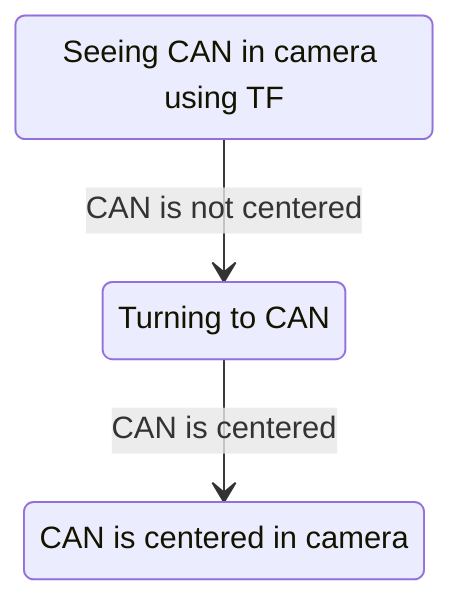

# RLP TMR2023 - Beach Cleaning Robot - Team Prosito
Team Prosito code repository for Beach Cleaning Robot for the Mexican Robotics Tournament 2023.

## TODO
- Agregar codigo de la competencia anterior
- Mejorar XD

## Table of Contents

## Motivation
- Travel
- Win (Again)

## Team Members
- [Agustín Zavala](https://github.com/AgustinZavalaA) 
- [Jesús Quiñones](https://github.com/Yisuslalala)
- [Grecia Reta]()# TODO agregar link de github
- [Alfredo Zuñiga]()# TODO agregar link de github

## Brainstorm
Aqui hay que escribir que fallo en el concurso anterior

- Conflicto con fechas de actividades realizadas (evitar que el tiempo nos gane)
- Contemplar repuestos para el robot (cablecitos, tornillos, etc)

- Checar el código antes de cada stage xd
- Aprender a usar el github XDDD

- cambiar sensores que no hacian nada
    - preguntar al doc y al resto del equipo cambios

- Simplificar el codigo, de manera que 

## Price and Budget
You can find the price and budget in the following link:  [google spreadsheet](https://docs.google.com/spreadsheets/d/1s7RXfJ0vAnRpx-cBgni985kJLPsVXK54_ZkF8j9CS0M/edit?usp=sharing)

## State Machine Diagram
This is an example of how we could use the state machine diagram to represent the robot's behavior.
