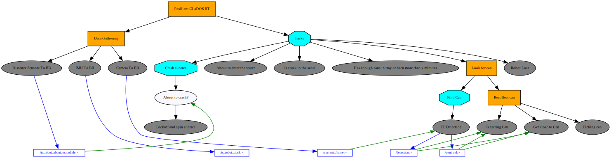

# RLP TMR2023 - Beach Cleaning Robot - Team Prosito

Team Prosito code repository for Beach Cleaning Robot for the Mexican Robotics Tournament 2023.

## TODO

- Agregar codigo de la competencia anterior

## Table of Contents

## Motivation

- Travel
- Win (Again)

## Team Members

- [Agustín Zavala](https://github.com/AgustinZavalaA)
- [Jesús Quiñones](https://github.com/Yisuslalala)
- [Grecia Reta]()# TODO agregar link de github

## Brainstorm

Aqui hay que escribir que fallo en el concurso anterior

- Conflicto con fechas de actividades realizadas (evitar que el tiempo nos gane)
    - Hacer un calendario de actividades por semana, para ver nuestro progreso (maybe usar la herramienta de yorick)

- Contemplar repuestos para el robot (cablecitos, tornillos, etc)
    - Tener refacciones y planificar estrategias de cambio de piezas

- Checar el código antes de cada stage
    - poner banderas en main para poder cambiar configuraciones rapidamente (tournament, debug)

- Aprender a usar el github
    - enseñarle lo basico a Grecia y Alfredo

- cambiar sensores que no hacian nada
    - preguntar al doc y al resto del equipo cambios, usar i2c

- Simplificar el codigo, de manera que sea sencillo hacer modificaciones y agregar estados.
    - por medio del nuevo modelo que vamos a realizar se espera que sea mas sencillo este paso

## Price and Budget

You can find the price and budget in the following
link:  [google spreadsheet](https://docs.google.com/spreadsheets/d/1s7RXfJ0vAnRpx-cBgni985kJLPsVXK54_ZkF8j9CS0M/edit?usp=sharing)

## Behavior Tree Design

Here is the behavior tree design for the robot.
It is generated automatically and is located in the `bt_images` folder.

